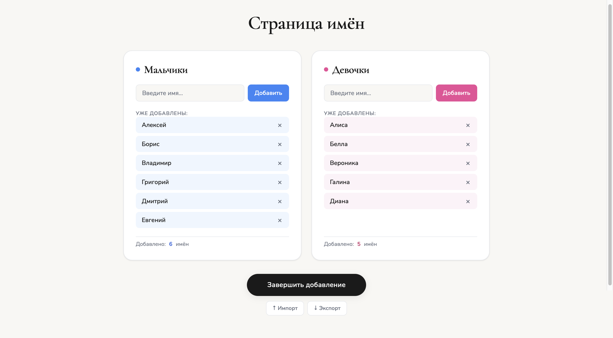
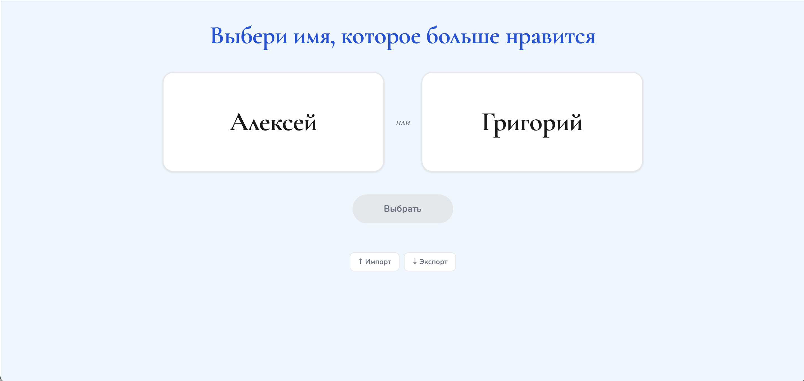

# Baby Names Tournament

> Турнир по выбору имени для ребёнка по системе двойного выбывания (Double Elimination)




## Описание

Добавляете имена мальчиков и девочек, которые рассматриваете для будущего ребёнка. Приложение случайным образом формирует пары, вы выбираете то, что нравится больше. Так продолжается до тех пор, пока не будут определены победитель среди мальчиков и победитель среди девочек.

Чтобы не прокликать всё за один раз, есть дневной лимит сравнений, который можно настроить в коде src/features/choice.js.

## Стек

- **JavaScript** (без фреймворков)
- **HTML / CSS**
- Без серверной части — все данные хранятся в `localStorage` браузера
- Импорт / экспорт данных в JSON для резервного копирования

## Требования

- [Node.js](https://nodejs.org/) и npm
- [git](https://git-scm.com) (желательно)

## Примечания

- Приложение тестировалось с **5–16 именами** в каждой категории. Поведение при других значениях не проверялось.

## Запуск

### Универсальный способ (Windows / Mac / Linux)

```bash
npm install
npm run dev
```

### Быстрый запуск на macOS

Если установлен Git, можно использовать `start.command`. Он автоматически подтянет последнюю версию ветки `main` и запустит dev-сервер:

```bash
# Дать права на запуск (один раз)
chmod +x start.command

# Запустить двойным кликом или через терминал
./start.command
```

## О проекте

Это мой первый полноценный пет-проект. HTML и CSS писались с помощью Claude, но весь JavaScript написан мной вручную. Основная цель была именно в изучении JS как языка.

## Планы

### В процессе
- [ ] Страница результатов по местам участников

### Приоритетно, в очереди
- [ ] Страница с итоговыми победителями обоих турниров

### Прочие идеи по развитию
- [ ] dev/prod окружения (разные ключи localStorage)
- [ ] Умный лимит выборов по неделям беременности
- [ ] Уведомление при финализации списка имён (вместо резкого редиректа)
- [ ] Попап гранд-финала: учитывать первый/второй финал, редирект на страницу победителей
- [ ] Подтверждение при импорте ("текущие данные будут заменены")
- [ ] Автоэкспорт в папку проекта (потребует серверную часть)
- [ ] Рефакторинг: вынести formatName в отдельную функцию
- [ ] Рефакторинг: два похожих обработчика карточек в один
- [ ] Тесты на другие размеры турниров (не 8 и 16)
- [ ] Линк на страницу с tournament.html

### Известные дефекты
- [ ] Нейтральный стиль на экране лимита (сейчас голубой фон мальчиков)
- [ ] Два одинаковых имени могут конфликтовать при удалении

### Сделано
- [x] Страница tournament.html с визуальной отрисовкой турнира
- [x] Описание к имени (редактируемое, отображается во время битвы)

---

*Автор: [Андрей Гаврилов, Andrew19683](https://github.com/Andrew19683)*